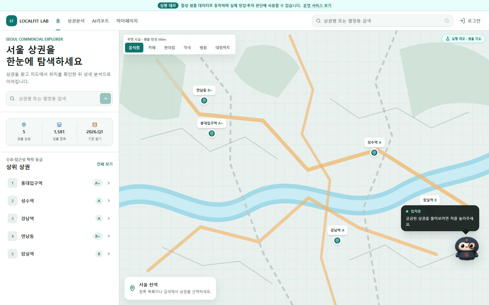
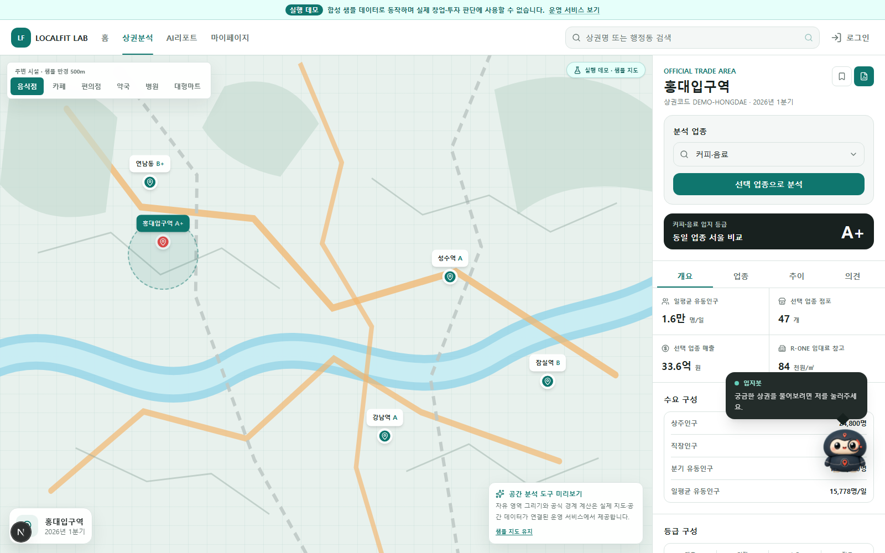
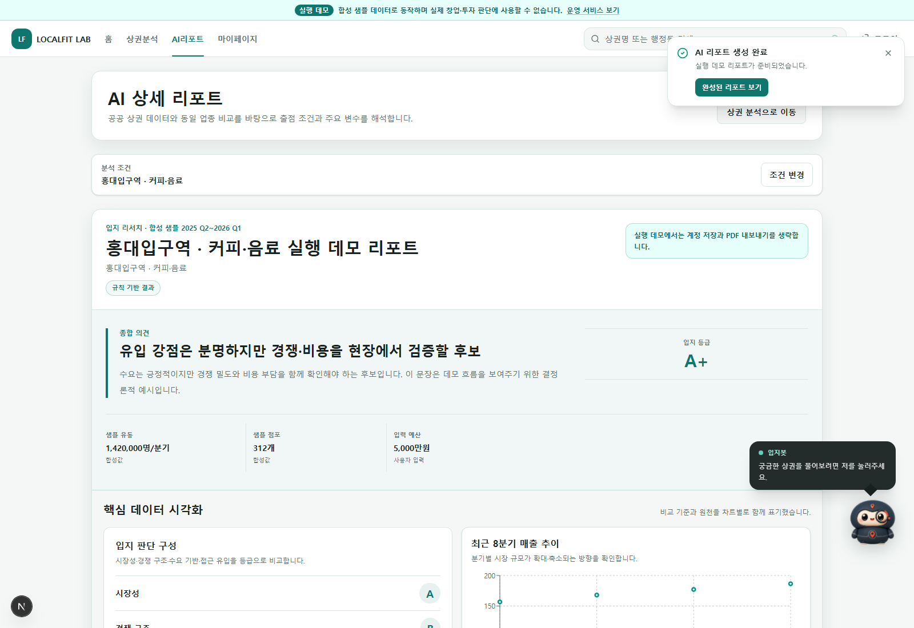
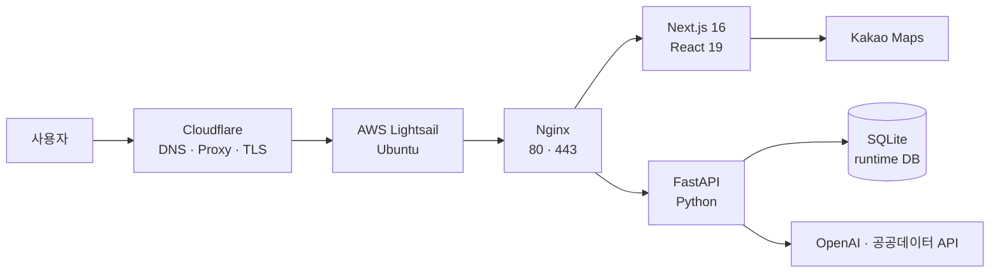

<p align="center">
  
</p>

<h1 align="center">LocalFit Lab</h1>

<p align="center">
  서울 상권 탐색과 출점 조건 검토를 하나의 워크스페이스로 연결합니다.
</p>

<p align="center">
  <a href="https://whago.net"><strong>운영 서비스</strong></a>
  ·
  <a href="#-1분-실행-데모"><strong>1분 실행 데모</strong></a>
  ·
  <a href="./DEPLOYMENT.md"><strong>배포 문서</strong></a>
</p>

<p align="center">
  
</p>

> [!IMPORTANT]
> 이 저장소의 **실행 데모**는 운영 DB, 회원 정보, API 키 없이 동작하는 합성 샘플입니다. 화면과 API 흐름을 체험하기 위한 것이며 실제 창업·투자 판단 자료가 아닙니다.

## 왜 LocalFit Lab인가

상권 데이터는 많지만, 후보 탐색부터 업종별 비교와 현장 확인 항목까지 한 흐름으로 이어지는 도구는 드뭅니다. LocalFit Lab은 다음 질문을 하나의 화면에서 연결합니다.

- 어디를 먼저 볼 것인가
- 해당 업종의 수요와 경쟁은 어떤가
- 매출·비용·접근성 중 무엇을 주의해야 하는가
- 숫자의 출처와 한계는 무엇인가
- 현장에 가서 무엇을 확인해야 하는가

## ⚡ 1분 실행 데모

필요한 것은 **Python 3.11+**와 **Node.js 20+**뿐입니다. 운영 데이터·Kakao 키·OpenAI 키는 필요하지 않습니다.

### Windows

```powershell
git clone https://github.com/rad1092/localfit-lab.git
cd localfit-lab
.\demo.cmd
```

탐색기에서 `demo.cmd`를 더블클릭해도 됩니다.

### macOS / Linux

```bash
git clone https://github.com/rad1092/localfit-lab.git
cd localfit-lab
chmod +x demo.sh
./demo.sh
```

최초 실행 때 Python 가상환경과 프론트엔드 패키지를 설치합니다. 준비되면 브라우저에서 `http://127.0.0.1:4310`이 열립니다.

### 데모에서 직접 해볼 수 있는 것

| 흐름 | 실행 데모 |
|---|---|
| 상권 검색·선택 | 5개 합성 서울 샘플 |
| 상권 상세 | 수요·점포·매출·비용·추이 |
| 업종 분석 | 커피·음료 등 4개 샘플 업종 |
| 입지봇 | 계정 없는 결정론적 샘플 응답 |
| AI 리포트 UI | 외부 모델 호출 없는 샘플 리포트 |
| 계정·관리자·PDF·실제 지도 | 운영 서비스에서 제공 |

<table>
  <tr>
    <td width="50%">
      
    </td>
    <td width="50%">
      
    </td>
  </tr>
  <tr>
    <td align="center"><strong>상권·업종 상세</strong></td>
    <td align="center"><strong>실행 데모 리포트</strong></td>
  </tr>
</table>

## 주요 기능

- Kakao 지도 기반 서울 상권 탐색
- 수요·경쟁·매출·비용·접근성·업종 지표 분석
- 상권별 근거 기반 AI 상세 리포트와 PDF 생성
- 뉴스·서울시·자치구·정부 자료를 활용한 근거 제시
- 분석 결과를 이어서 질문하는 입지봇
- 회원·관리자 기능, 리포트 평가와 데이터 운영 상태 확인

## 구조



| Layer | Stack |
|---|---|
| Frontend | Next.js 16, React 19, TypeScript, Tailwind CSS, Recharts |
| Backend | FastAPI, SQLAlchemy, Pydantic, Shapely, pyproj |
| AI / Report | OpenAI API, ReportLab, Matplotlib |
| Production | AWS Lightsail, Nginx, systemd, Certbot, Cloudflare |

## 저장소 구성

```text
.
├─ demo.cmd / demo.ps1 / demo.sh    원클릭 실행 데모
├─ final_proj/
│  ├─ frontend/                     Next.js 사용자·관리자 화면
│  ├─ backend/
│  │  ├─ main.py                    운영 FastAPI 앱
│  │  └─ demo_main.py               DB·키 없는 공개 데모 앱
│  ├─ resources/                    공개 가능한 정제 근거와 계약 자료
│  ├─ docs/                         제품·아키텍처·데이터 계약 문서
│  └─ scripts/                      로컬 개발 도구
├─ scripts/                         수집·전처리·검증 파이프라인
├─ config/                          공개 설정
└─ deploy/lightsail/                운영 배포·검증 스크립트
```

## 운영 개발 환경

실제 데이터와 외부 API를 연결하는 전체 개발 환경은 데모와 분리되어 있습니다.

```powershell
# Backend
cd final_proj\backend
python -m venv ..\.venv
..\.venv\Scripts\Activate.ps1
pip install -r requirements.txt
Copy-Item .env.example .env
python -m uvicorn main:app --host 127.0.0.1 --port 8000 --reload

# Frontend (새 터미널)
cd final_proj\frontend
npm ci
Copy-Item .env.example .env.local
npm run dev -- --hostname 127.0.0.1 --port 3000
```

`final_proj/backend/.env`에는 본인의 API 키와 데이터 경로를, `final_proj/frontend/.env.local`에는 Kakao JavaScript 키를 설정합니다.

## 검증

```powershell
# 공개 실행 데모 smoke test
.\demo.ps1 -NoBrowser -CheckOnly

# 데모 API 테스트
cd final_proj\backend
python -m pytest -q tests\test_demo_main.py

# Frontend
cd ..\frontend
npm run lint
npm run build
```

## 운영 서비스

- Live: [https://whago.net](https://whago.net)
- WWW: [https://www.whago.net](https://www.whago.net)
- Health: [https://whago.net/healthz](https://whago.net/healthz)
- Deployment: [DEPLOYMENT.md](DEPLOYMENT.md)

## 공개 범위

이 저장소에는 서비스 코드와 공개 가능한 문서만 포함합니다. 다음 항목은 Git에 올리지 않습니다.

- 실제 `.env`와 API 키
- 운영 관리자 계정과 인증 정보
- SQLite 운영 DB, 회원·리포트·댓글 데이터
- 원본·가공 데이터셋과 배포용 데이터 번들
- 생성된 PDF, 차트, 로그, 캐시
- 다운로드한 논문·웹페이지 원문

실행 데모의 모든 수치는 `demo.synthetic.v1` 합성 픽스처이며 운영 지표가 아닙니다. 전체 운영 데이터를 재현하려면 별도의 데이터 준비가 필요합니다.
