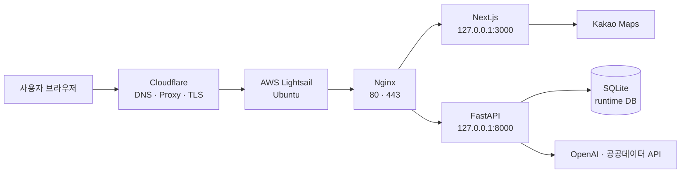

# LocalFit Lab

서울 상권을 지도에서 탐색하고, 수요·경쟁·매출·비용·접근성 지표와 근거 기반 AI 리포트로 입지를 분석하는 웹 서비스입니다.

## 운영 서비스

**[https://whago.net](https://whago.net)**

- 대표 도메인: `whago.net`
- 보조 도메인: `www.whago.net`
- 상태 확인: [https://whago.net/healthz](https://whago.net/healthz)
- 호스팅: AWS Lightsail (Ubuntu)
- DNS·프록시·외부 TLS: Cloudflare
- 원본 서버: Nginx + Next.js + FastAPI



도메인과 서버 연결 방법은 [DEPLOYMENT.md](DEPLOYMENT.md)에 정리했습니다.

## 주요 기능

- Kakao 지도 기반 서울 상권 탐색
- 수요·경쟁·매출·비용·접근성·업종 지표 분석
- 상권별 AI 상세 리포트와 PDF 생성
- 뉴스·서울시·자치구·정부 자료를 활용한 근거 제시
- 분석 결과를 이어서 질문하는 입지봇
- 회원·관리자 기능, 리포트 평가와 데이터 운영 상태 확인

## 기술 구성

- Frontend: Next.js 16, React 19, TypeScript, Tailwind CSS, Recharts
- Backend: FastAPI, SQLAlchemy, Pydantic, Shapely, pyproj
- AI/Report: OpenAI API, ReportLab, Matplotlib
- Production: AWS Lightsail, Nginx, systemd, Certbot, Cloudflare

## 저장소 구조

```text
.
├─ final_proj/
│  ├─ frontend/        Next.js 사용자·관리자 화면
│  ├─ backend/         FastAPI API, 분석, 인증, 리포트
│  ├─ resources/       공개 가능한 정제 근거와 계약 자료
│  ├─ docs/            제품·아키텍처·데이터 계약 문서
│  ├─ runtime/README.md
│  └─ scripts/         로컬 개발 실행 도구
├─ scripts/            수집·전처리·검증 파이프라인
├─ config/             공개 설정
└─ deploy/lightsail/   운영 배포·검증 스크립트
```

## 로컬 실행

### Backend

```powershell
cd final_proj\backend
python -m venv ..\.venv
..\.venv\Scripts\Activate.ps1
pip install -r requirements.txt
Copy-Item .env.example .env
python -m uvicorn main:app --host 127.0.0.1 --port 8000 --reload
```

`final_proj/backend/.env`의 자리표시자에 본인의 API 키와 로컬 경로를 설정합니다.

### Frontend

```powershell
cd final_proj\frontend
npm ci
Copy-Item .env.example .env.local
npm run dev -- --hostname 127.0.0.1 --port 3000
```

`final_proj/frontend/.env.local`에 Kakao JavaScript 키를 설정합니다.

## 검증

```powershell
# Backend: 공개 데이터 없이 실행 가능한 테스트
cd final_proj\backend
..\.venv\Scripts\python.exe -m pytest -q `
  --ignore=tests/test_admin_pipeline_flexibility.py `
  --ignore=tests/test_operational_monitoring.py `
  --ignore=tests/test_spatial_analysis.py

# Frontend
cd ..\frontend
npm run lint
npm run build
```

제외된 백엔드 통합 테스트 3개는 비공개 `datacorpus/`와 데이터가 채워진 런타임 DB가 있는 전체 운영 개발 환경에서 실행합니다.

## 공개 범위

이 저장소는 서비스 코드와 공개 가능한 문서만 포함합니다. 아래 항목은 보안·개인정보·용량 문제로 Git에 올리지 않습니다.

- 실제 `.env`와 API 키
- 운영 관리자 계정과 인증 정보
- SQLite 운영 DB, 회원·리포트·댓글 데이터
- 원본·가공 데이터셋과 배포용 데이터 번들
- 생성된 PDF, 차트, 로그, 캐시
- 다운로드한 논문·웹페이지 원문

따라서 전체 운영 데이터를 재현하려면 별도의 데이터 준비가 필요합니다. 배포 스크립트는 앱 번들과 데이터 번들을 분리하도록 구성되어 있습니다.
