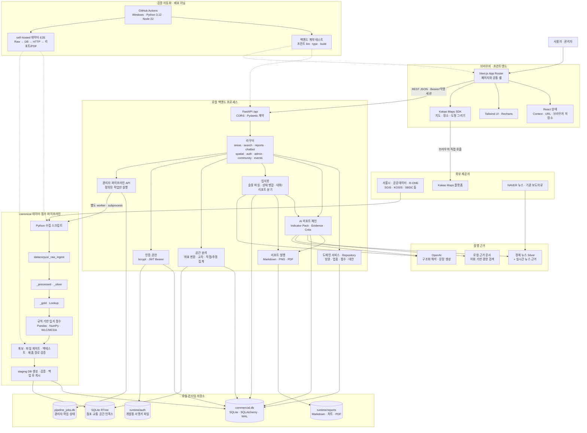
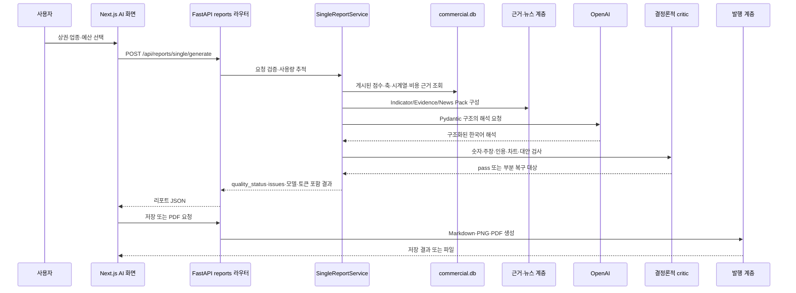
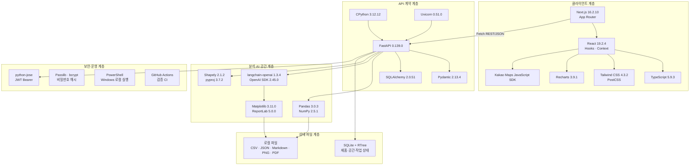

# LocalFit Lab 시스템 구조와 기술 스택 — 상세 기술 참조

> 기준: 2026-07-21 현재 로컬 작업 트리  
> 대상: 개발자, 인수인계 담당자, 운영 담당자  
> 현재 실행 형태: Windows 단일 호스트의 Next.js 개발 서버 + FastAPI/Uvicorn + SQLite/로컬 파일

## 먼저 결론

LocalFit Lab은 현재 **프런트엔드와 API가 분리된 모듈형 모놀리스**에 가깝다. 브라우저의 Next.js 앱이 FastAPI REST API를 직접 호출하고, FastAPI 내부에서 상권 조회·공간 분석·리포트·챗봇·인증·관리자 기능을 라우터와 서비스 단위로 나눈다. 주 제품 상태는 하나의 SQLite DB와 로컬 리포트 파일에 저장된다.

가장 중요한 설계 경계는 다음과 같다.

- **오프라인 분석 계층**이 공공 원천을 Raw → Silver → Gold로 정제하고 WLC/MCDA 규칙 엔진으로 입지 점수를 계산한다.
- **온라인 제품 계층**은 미리 계산해 게시한 점수와 근거를 조회한다.
- **OpenAI 계층**은 점수를 새로 만들지 않고, 구조화된 점수·지표·근거를 해석해 한국어 설명과 리포트를 생성한다.
- **결정론적 critic 계층**은 LLM 결과의 금지 주장, 숫자 불일치, 인용·차트·대안·사용자 조건 누락을 검사한다.
- 현재 저장소에는 AWS, 도메인, TLS, Docker, 운영 리버스 프록시, 배포 자동화가 없다. 따라서 아래 그림의 실행 경계는 로컬 단일 호스트다.

## 1. 시스템 구조 — 상세 시각화

아래 그림은 사용자 요청을 처리하는 온라인 경로와 데이터를 갱신하는 오프라인 경로를 함께 보여준다. 온라인 요청은 이미 게시된 제품 DB를 사용하고, 관리자 갱신 작업만 canonical 데이터 파이프라인을 실행해 DB를 다시 게시한다.



### 그림을 읽는 순서

1. 사용자는 브라우저의 Next.js 화면을 사용한다.
2. 지도 렌더링과 장소 검색 일부는 브라우저가 Kakao Maps SDK를 직접 호출한다.
3. 나머지 제품 기능은 FastAPI `/api`를 호출한다. Next.js Route Handler나 서버 프록시는 현재 없다.
4. 일반 상권 조회는 SQLAlchemy를 통해 `commercial.db`의 게시된 데이터를 읽는다.
5. 공간 분석은 SQLite RTree로 후보를 줄이고 Shapely로 실제 포함 여부를 판정한다.
6. AI 리포트와 입지봇은 DB의 수치·규칙 점수·근거를 먼저 구성한 뒤 OpenAI에 설명을 요청한다.
7. 관리자가 데이터 갱신을 실행하면 별도 worker가 미리 정의된 17단계 파이프라인을 수행하고 staging DB를 검증한 뒤 제품 DB를 게시한다.
8. GitHub Actions는 이 구조를 검증하지만, 운영 서버로 배포하지는 않는다.

## 2. 온라인 요청과 오프라인 계산의 경계

| 경계 | 온라인 요청에서 하는 일 | 미리 계산하거나 별도로 하는 일 |
| --- | --- | --- |
| 상권 점수 | 게시된 `rule_location_score`·요약을 조회 | Gold 데이터로 WLC/MCDA 규칙 점수 생성 |
| 업종 분석 | 업종을 해석하고 해당 점수·지표를 조합 | 업종 계층·입력 lookup·분기별 score batch 생성 |
| 공간 분석 | 요청 도형의 직접 집계 또는 면적비 추정 | 공식 경계·점포·교통 좌표를 SQLite RTree로 게시 |
| AI 리포트 | 지표 팩을 만들고 LLM 해석·critic 수행 | RAG 문서 정제, 뉴스 Silver, 점수·근거 게시 |
| 관리자 갱신 | 작업 생성·상태 조회·취소 | worker가 수집·전처리·점수·검증·DB 게시 수행 |

이 구분 덕분에 일반 사용자의 리포트 요청마다 전체 원천 수집이나 점수 재계산을 하지 않는다. 반대로 데이터 갱신이 성공하기 전에는 새 원천이 온라인 결과에 자동 반영되지 않는다.

## 3. 핵심 요청 흐름

### 3.1 상권 탐색과 분석

```text
홈 검색 또는 지도 선택
→ GET /api/search, /api/areas/rankings, /api/areas/stats
→ /trade?areaCode=...
→ GET /api/areas/{code}?industry_code=...
→ Repository가 최신 상권·업종·점수·시계열 조회
→ Pydantic 응답
→ 수요·점포·매출·비용 참고·경쟁·댓글을 화면에 표시
```

프런트는 React Context와 URL 쿼리로 선택 상권을 복원한다. Redux, Zustand, TanStack Query, SWR, GraphQL 같은 별도 상태/데이터 계층은 없다.

### 3.2 AI 단일 리포트



세부 원칙은 다음과 같다.

- `SingleReportService`는 점수를 새로 계산하지 않고 DB의 규칙 결과를 payload로 만든다.
- `Indicator Pack`은 점수, 매출, 점포, 인구, 비용 근거, 대안, 차트용 수치를 모은다.
- 로컬 RAG는 문서를 임베딩하지 않고 어휘 점수로 근거 조각을 고른다.
- OpenAI는 Pydantic 구조화 출력으로 호출된다. 리포트 reasoning effort가 지정되면 Responses API 경로를 사용한다.
- critic은 금지 주장, 없는 숫자, 내부 경로 노출, 근거 복사, 해석 부재, 차트/인용/대안/사용자 조건 누락을 검사한다.
- `quality_status=pass`는 이 계약 검사 통과를 뜻할 뿐, 현실 사업 성공이나 전체 사실 정확도를 보장하지 않는다.

### 3.3 입지봇

```text
POST /api/chatbot/chat
→ LLM 구조화 슬롯 추출(상권·업종·예산·의도)
→ 이전 상태와 새 값을 병합하고 후보를 확정
├─ 일반 질문: 선택 상권 집계 + 직전 리포트 근거 → 짧은 대화 답변
└─ 명시적 리포트 요청: AI 단일 리포트와 같은 해석 엔진
   → 짧은 요약 → chatbot_history 저장
   → 로그인 사용자는 saved_report에도 연결
   → 차트·PDF 발행 가능
```

슬롯 추출이나 LLM 호출이 실패하면 보수적인 기본값 또는 결정론적 fallback을 반환한다. 현재 `evaluate_chatbot.py`는 이 실제 `/api/chatbot/chat` 경로가 아니라 구형 함수를 평가하므로, 그 결과를 현재 입지봇 정확도로 사용하면 안 된다.

### 3.4 지도와 사용자 지정 공간

```text
Kakao 지도에서 공식 상권 선택 또는 원·사각형·다각형 그리기
→ POST /api/spatial/zones/analyze
→ WGS84(EPSG:4326)를 서울권 미터 좌표(EPSG:5181)로 변환
→ SQLite RTree로 점포·교통 후보 검색
→ Shapely로 실제 포함·교차·면적 계산
→ 직접 집계 / 공식 상권 값 / 면적비 추정 / 광역 참고를 구분
→ 방법·신뢰도·커버리지와 함께 응답
```

공간 응답은 계산 방식의 차이를 숨기지 않는다. 직접 포함 집계와 면적비 추정을 같은 정확도의 값처럼 표시하면 안 된다.

### 3.5 인증과 관리자 작업

- 회원가입 비밀번호는 bcrypt 계열로 해시해 `users`에 저장한다.
- 로그인은 HS256 JWT를 발급하고 기본 유효기간은 7일이다.
- 프런트는 토큰을 `localStorage`에 두고 공통 fetch에서 Bearer 헤더를 붙인다.
- 익명 사용자는 브라우저 UUID를 30일간 보관해 `X-LocalFit-Session`으로 보낸다.
- 관리자 파이프라인은 임의 명령 문자열이 아니라 코드에 등록된 작업 정의만 실행한다.
- 개발 환경에서는 로컬 관리자 API가 열릴 수 있지만 production 환경에서는 관리자 계정을 요구한다.
- 장기 작업은 API 프로세스 안에서 직접 수행하지 않고 별도 worker/subprocess와 `pipeline_jobs.db`로 상태를 관리한다.

## 4. 데이터 계보와 게시 흐름


canonical 데이터는 `final_proj/datacorpus`가 아니라 workspace 상위 `C:\final_map_project\datacorpus`다. 제품 폴더는 원천을 소유하지 않고 소비한다. source registry는 핵심 상권 원천과 생활이동, RTMS, R-ONE, SBDC, SGIS, KOSIS, 주소/공간 보조 원천 및 뉴스 근거를 관리한다.

관리자 `refresh_product_data`는 현재 17단계이며 핵심 수집, Silver/Gold/lookup, 점수, 검증, 제품 DB, 공간 인덱스를 잇는다. 일부 대용량·후보 원천은 핵심 17단계 바깥에서 별도 관리되므로 “모든 외부 원천을 한 번에 완전 갱신한다”고 설명하면 안 된다.

## 5. 런타임 저장소

| 저장소 | 역할 | 특성 |
| --- | --- | --- |
| `runtime/db/commercial.db` | 상권·업종·시계열·규칙점수·비용근거·사용자·리포트·로그·AI 캐시 | SQLite, SQLAlchemy, WAL, 단일 파일 |
| SQLite RTree 테이블 | 점포와 교통 지점의 공간 후보 인덱스 | 제품 DB 안에 게시 |
| `runtime/admin/pipeline_jobs.db` | 관리자 작업·단계·상태·설정 | 제품 DB와 별도 SQLite |
| `runtime/reports/{id}/` | Markdown, 차트 PNG, PDF | 로컬 파일 시스템 |
| `runtime/auth/` | 개발 환경에서 생성한 JWT 서명키 | production은 외부 `SECRET_KEY` 필요 |
| `datacorpus/` | Raw·Processed·Silver·Gold·검증·점수 산출물 | workspace-level canonical 데이터 |
| `resources/knowledge/rag_sources/` | 제품용으로 정제한 로컬 근거 문서 | 어휘 기반 검색 입력 |

현재 제품 DB는 읽기 전용 점검에서 약 364MB, `sqlite_%`를 제외한 테이블 34개, `quick_check=ok`, 외래키 위반 0이었다. 이 수치는 구조 설명용 스냅샷이며 데이터 규모 SLA가 아니다.

## 6. 기술 스택 — 상세 시각화

이 그림은 “설치되어 있음”이 아니라 현재 코드 경로에서 실제 역할을 가진 핵심 기술을 계층별로 묶는다.



### 6.1 프런트엔드

| 영역 | 기술 | 실제 역할 | 버전 근거 |
| --- | --- | --- | --- |
| 프레임워크 | Next.js App Router | 페이지 라우팅, 공통 layout, client component 실행 | `package-lock.json` 16.2.10 |
| UI | React / React DOM | Hooks, Context, 컴포넌트 상태 | 19.2.4 |
| 언어 | TypeScript | strict 타입 검사, noEmit 검사 | 5.9.3 |
| 스타일 | Tailwind CSS + PostCSS | 전역 스타일과 utility class | 4.3.2 |
| 테마 | next-themes | 색상 테마 제공 | 0.4.6 |
| 차트 | Recharts | 리포트와 분석 막대·선 차트 | 3.9.1 |
| 지도 | Kakao Maps JavaScript SDK | 지도, 장소 검색, 경계/도형, 클러스터·드로잉 | 외부 SDK |
| 아이콘/클래스 | lucide-react, clsx | 아이콘과 조건부 class | 1.23.0 / 2.1.1 |
| 통신 | Browser Fetch API | FastAPI 직접 호출 | 브라우저 내장 |
| 상태 | React Context, URL, local/session storage | 상권 선택, 인증·게스트, 임시 UI 상태 | 별도 전역 상태 라이브러리 없음 |

`mapbox-gl`, `react-map-gl`, `tailwind-merge`는 의존성 목록에 있지만 현재 `src`에서 사용되지 않는다. `components.json`은 shadcn 생성기 설정이지만 실제 `src/components/ui`가 없으므로 shadcn/ui를 활성 스택으로 적지 않는다.

### 6.2 백엔드와 API

| 영역 | 기술 | 실제 역할 | 현재 로컬 버전 |
| --- | --- | --- | ---: |
| 언어 | CPython | API, 데이터, 리포트, 관리자 작업 | 3.12.12 |
| API | FastAPI | REST 라우터, 의존성, OpenAPI | 0.139.0 |
| ASGI | Uvicorn | 로컬 API 프로세스 | 0.51.0 |
| 계약 | Pydantic | 요청·응답·LLM 구조화 출력 | 2.13.4 |
| ORM | SQLAlchemy | 제품 DB session과 모델 | 2.0.51 |
| 인증 | python-jose | HS256 JWT | 3.5.0 |
| 비밀번호 | Passlib / bcrypt | 비밀번호 해시·검증 | 1.7.4 / 현재 bcrypt 패키지 |

백엔드 `requirements.txt`는 버전을 고정하지 않는다. 표의 Python 패키지 버전은 현재 `.venv` 스냅샷이지 재현 가능한 lock 계약이 아니다.

### 6.3 데이터·점수·AI·공간·문서

| 영역 | 기술 | 역할 | 현재 로컬 버전/형태 |
| --- | --- | --- | --- |
| 데이터 처리 | Pandas, NumPy | 수집 결과 정제, Gold, 규칙 점수, 검증 | 3.0.3 / 2.5.1 |
| 점수 방법 | WLC/MCDA 규칙 엔진 | 검증된 지표와 가중치로 입지 점수 생성 | `loc_score.v2.6-coverage-contract-rc1` |
| LLM 연결 | langchain-core, langchain-openai | Pydantic 구조화 출력, usage callback | 1.4.9 / 1.3.4 |
| OpenAI | OpenAI Python SDK | 리포트·챗봇 해석 호출 | 2.45.0, 기본 별칭 `gpt-5.4-mini` |
| 로컬 근거 검색 | Python 어휘 점수 | 정제 문서에서 관련 문단 선택 | Vector DB 없음 |
| 공간 | Shapely, pyproj | 도형 판정, 교차·면적, 좌표 변환 | 2.1.2 / 3.7.2 |
| 공간 인덱스 | SQLite RTree, Shapely STRtree | 후보 검색과 직접 포함 판정 | SQLite/메모리 |
| 차트/PDF | Matplotlib, ReportLab | PNG 차트와 PDF 생성 | 3.11.0 / 5.0.0 |

## 7. API 구성

실행 중인 OpenAPI 기준 현재 62개 path와 68개 operation이 조립된다. 기능별 주요 경계는 다음과 같다.

| 태그 | 역할 | operation 수 |
| --- | --- | ---: |
| reports | 단일·비교 리포트, 저장, PDF, 차트 | 12 |
| admin | 대시보드, 연동, 모델 설정, 작업·비용 | 11 |
| chatbot | 대화, 분석, 이력, 리포트·차트·다운로드 | 9 |
| admin-ops | 분석, 데이터 품질, 오류, 댓글 운영 | 9 |
| areas | 목록, 상세, 대시보드, 추천, 비교, 순위, 통계 | 7 |
| spatial | 경계·상태·사용자 영역 분석 | 4 |
| comments/auth | 커뮤니티와 계정 | 각각 4 |
| favorites | 즐겨찾기 | 3 |
| 기타 | search, rankings, events, client-events, root | 각각 1 |

operation 수는 기능 복잡도나 품질 점수가 아니라 현재 외부 계약의 범위를 보여주는 보조 지표다.

## 8. 보안과 신뢰 경계

| 경계 | 현재 방식 | 주의점 |
| --- | --- | --- |
| 브라우저 ↔ API | CORS 허용 origin + REST | production origin을 명시해야 함 |
| 인증 | Bearer JWT, 기본 7일 | 프런트가 localStorage에 저장하므로 XSS 방어가 중요 |
| 비밀번호 | bcrypt 해시 | 평문을 DB에 저장하지 않음 |
| 관리자 | 환경별 관리자 의존성 | development의 로컬 공개 동작을 production에 가져가면 안 됨 |
| 비밀값 | backend 환경변수/외부 key 파일 | 프런트 asset, 로그, 리포트에 넣지 않음 |
| Kakao 지도 | 브라우저 공개 키 + 허용 도메인 | 운영 도메인을 Kakao 콘솔에 등록해야 함 |
| LLM | 숫자·근거 팩을 전달하고 critic으로 검사 | 모델 결과 자체를 점수의 정본으로 쓰지 않음 |
| 데이터 게시 | staging DB 검증·기존 DB 백업 후 게시 | 단일 파일 교체와 백업 보존 정책이 필요 |

## 9. CI와 운영

- 일반 CI는 Windows runner에서 Python 3.12 백엔드 컴파일·계약 테스트를 실행한다.
- 프런트 CI는 Node 22에서 `npm ci`, lint, TypeScript noEmit, production build를 실행한다.
- 데이터 E2E는 canonical `datacorpus`가 있는 self-hosted Windows runner에서 Raw/Gold/DB/HTTP/리포트/PDF를 검증한다.
- 이 워크플로들은 **검증** 용도이며 EC2/ECS/S3/RDS 등에 배포하지 않는다.
- 로컬 `start-dev.ps1`은 127.0.0.1의 3000/8000 포트에 reload 개발 서버를 띄운다.

## 10. 현재 한계와 문서에 넣으면 안 되는 주장

1. **AWS 배포 완료**: 근거 없음. Dockerfile, Compose, Terraform, CloudFormation, CDK, 운영 reverse proxy, domain/TLS, deploy workflow가 없다.
2. **LLM이 입지 점수를 계산**: 틀림. 규칙 엔진이 계산하고 LLM은 설명한다.
3. **Vector DB 기반 RAG**: 틀림. 현재 로컬 문서 어휘 기반 검색이다.
4. **`quality_status=pass`가 전체 정확도 보증**: 틀림. deterministic critic 계약 통과다.
5. **비교 리포트가 단일 리포트와 동일한 공식 업종 4축 추천**: 현재 구현 범위와 다르다.
6. **모든 Python 버전이 고정됨**: 틀림. `requirements.txt`가 잠겨 있지 않다.
7. **정식 DB migration 체계가 있음**: 틀림. Alembic 없이 `create_all()`과 수동 `ALTER TABLE`을 쓴다.
8. **Mapbox가 실제 지도 엔진**: 틀림. 패키지는 설치되어 있지만 실제 지도는 Kakao다.
9. **GitHub Actions가 운영 배포까지 수행**: 틀림. CI와 데이터 E2E 검증만 한다.

추가 유지보수 위험은 다음과 같다.

- 실제 점수 정본은 workspace 루트 `scripts/build_rule_based_location_scores.py`인데 백엔드 내부에도 다른 해시의 유사 파일이 있다.
- SQLite 스키마 `user_version`이 0이고 수동 업그레이드이므로 운영 배포 전 migration 전략이 필요하다.
- 제품 DB·리포트·관리자 작업 DB·백업이 모두 로컬 디스크에 의존한다.
- DB 백업 자동 보존기간 정리 로직이 확인되지 않았다.
- 현재 챗봇 평가 스크립트는 실제 production chat route를 평가하지 않는다.

## 11. AWS·도메인 작업 전에 결정할 배포 경계

이 표는 현재 구현이 아니라 이후 설계 결정 목록이다.

| 결정 영역 | 현재 상태 | 배포 전에 정할 질문 |
| --- | --- | --- |
| 웹/백엔드 실행 | 로컬 2개 프로세스 | 단일 VM인지, 컨테이너 분리인지 |
| 제품 DB | 로컬 SQLite | 단일 writer를 유지할지, 관리형 DB로 옮길지 |
| 공간 인덱스 | SQLite RTree | DB 이전 시 어떤 공간 검색 방식으로 유지할지 |
| 리포트 파일 | 로컬 디스크 | 영속 볼륨인지 객체 저장소인지 |
| 관리자 작업 | 로컬 subprocess | 단일 host worker인지 별도 큐/worker인지 |
| ingress | 3000/8000 직접 포트 | 한 도메인 reverse proxy와 HTTPS를 어떻게 구성할지 |
| 비밀값 | 로컬 환경파일 | 운영 secret 주입·회전·권한을 어떻게 관리할지 |
| 백업 | 로컬 DB 백업 | 보존기간, 복원 훈련, 외부 저장을 어떻게 할지 |
| 관측 | 로컬 로그·DB 사용량 | 중앙 로그, 오류, 지연시간, 비용을 어디에 모을지 |
| 지도 | 로컬 허용 주소 | 운영 도메인을 Kakao 콘솔에 어떻게 등록할지 |

AWS·도메인이 완료되면 이 문서의 첫 그림에서 `로컬 백엔드 프로세스`와 `로컬 런타임 저장소`를 실제 운영 서비스로 교체하고, CORS·TLS·백업·worker·저장소 경계를 다시 작성해야 한다.

## 12. 핵심 코드 안내

- 프런트 공통 셸: [layout.tsx](../../frontend/src/app/layout.tsx)
- 공통 API 호출: [api.ts](../../frontend/src/lib/api.ts)
- 지도: [KakaoMap.tsx](../../frontend/src/components/KakaoMap.tsx)
- FastAPI 조립: [main.py](../../backend/main.py)
- 상권 repository: [commercial_area.py](../../backend/app/repositories/commercial_area.py)
- AI 해석: [interpretive_report.py](../../backend/app/services/interpretive_report.py)
- 리포트 critic: [report_critic.py](../../backend/app/services/report_critic.py)
- 챗봇: [chatbot.py](../../backend/app/routers/chatbot.py)
- 공간 분석: [spatial_analysis.py](../../backend/app/services/spatial_analysis.py)
- 관리자 파이프라인: [admin_pipeline.py](../../backend/app/services/admin_pipeline.py)
- 데이터 계보: [data-lineage.md](../data-contracts/data-lineage.md)
- 실제 점수 정본: [build_rule_based_location_scores.py](../../../scripts/build_rule_based_location_scores.py)
- 검증 근거: [SOURCE_NOTES.md](SOURCE_NOTES.md)
