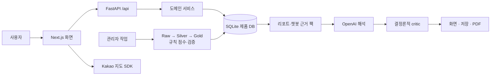
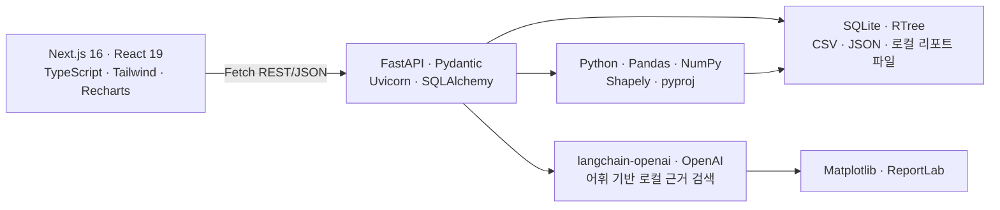

# LocalFit Lab 시스템 구조와 기술 스택 — LLM 인계용

> 기준: 2026-07-21 현재 로컬 작업 트리  
> 목적: 다른 LLM 또는 코딩 에이전트가 잘못 추정하지 않고 현재 제품을 빠르게 이해하도록 하는 최소 문맥  
> 사용법: 이 문서 전체를 먼저 제공하고, 변경 작업에는 관련 소스 파일을 추가로 제공한다.

## 핵심 문맥

LocalFit Lab은 서울 상권 입지 분석 제품이다. 브라우저의 Next.js 앱이 FastAPI API를 직접 호출한다. 제품 점수의 정본은 LLM 출력이 아니라 canonical 데이터 파이프라인과 규칙 기반 WLC/MCDA 엔진이 게시한 SQLite 데이터다. OpenAI는 점수와 근거를 받아 한국어 설명·리포트·대화 응답을 만들며, 결정론적 critic이 결과 계약을 검사한다. 현재 배포는 로컬 Windows 단일 호스트이고 AWS·운영 도메인은 구현되지 않았다.

## 1. 시스템 구조 — 간략 시각화

아래 그림에서 굵은 제품 경로는 사용자 요청, 아래쪽 경로는 관리자 데이터 갱신이다. LLM은 점수 계산기 뒤에 있는 설명 계층이다.



### 최소 데이터 흐름

```text
공공 원천 → Python 수집/전처리 → canonical datacorpus
→ Gold/lookup → WLC/MCDA 규칙 점수 → staging 검증
→ commercial.db + RTree 게시
→ FastAPI 조회 → Next.js 표시
→ 필요한 경우 OpenAI가 근거 기반 설명 → critic → 리포트/PDF
```

## 2. 기술 스택 — 간략 시각화

이 그림에는 현재 소스에서 실제로 쓰는 핵심만 넣었다. 설치 목록에만 남은 Mapbox 계열은 제외했다.



## 3. 다른 LLM이 바로 읽을 구조화 문맥

```yaml
document:
  purpose: "LocalFit Lab current architecture and stack handoff"
  as_of: "2026-07-21"
  evidence_scope: "current local worktree + live local HTTP/OpenAPI + read-only SQLite"
  authority_order:
    - "current runtime and code"
    - "current data contracts and CI"
    - "README or historical documents"

system:
  name: "LocalFit Lab"
  domain: "Seoul commercial-area location analysis and evidence-based reports"
  architecture_style: "separated frontend and API; modular-monolith backend; offline data/scoring pipeline"
  current_topology: "single Windows host, two web processes, local SQLite and local files"

  truth_boundaries:
    location_score_authority: "offline deterministic WLC/MCDA rule engine"
    score_source: "validated Gold data and published rule score tables"
    llm_role: "interpret existing facts/scores, produce Korean structured text and conversation"
    llm_non_role: "must not be described as the authority that calculates official location scores"
    report_quality_status: "contract-validator result; not business success or total accuracy certification"
    rag_type: "local lexical document retrieval; no embedding or vector database"

  online_path:
    - "browser uses Next.js App Router UI"
    - "browser calls FastAPI /api directly with Fetch"
    - "FastAPI router delegates to services/repository"
    - "SQLAlchemy reads/writes runtime/db/commercial.db"
    - "spatial path uses SQLite RTree candidate search plus Shapely exact geometry checks"
    - "report/chat path builds deterministic facts and evidence before any LLM call"
    - "OpenAI returns Pydantic-structured interpretation"
    - "deterministic critic validates claims/numbers/citations/charts/alternatives/user conditions"
    - "publisher emits JSON, Markdown, PNG charts, and PDF"

  offline_path:
    - "external sources and source registry"
    - "Python collection scripts"
    - "datacorpus/_raw_ingest"
    - "_processed and _silver"
    - "_gold and lookup tables"
    - "rule-based score batch"
    - "lineage/file/backtest/product-grounding validation"
    - "staging SQLite validation and backup"
    - "publish commercial.db and rebuild spatial RTree"

  actors:
    user:
      actions: ["search area", "analyze trade area", "draw custom zone", "generate report", "use chatbot", "save/download result"]
    guest:
      identity: "browser-generated anonymous session UUID"
      header: "X-LocalFit-Session"
    authenticated_user:
      identity: "JWT Bearer token"
    admin:
      actions: ["inspect sources", "run predefined jobs", "view data quality", "view cost/error/analytics", "moderate comments"]

  frontend:
    shell: "ThemeProvider -> SelectedAreaProvider -> navigation/page -> global Chatbot"
    main_routes:
      "/": "search, overview statistics, rankings, map entry"
      "/trade": "primary area/industry/spatial/competition analysis workspace"
      "/ai": "single and comparison AI report generation, save, PDF"
      "/mypage": "favorites, chatbot history, saved reports"
      "/reports/[id]": "chatbot-history report detail"
      "/admin": "operations console"
      "/login": "login and guest entry"
      "/register": "registration"
    state: ["React Hooks", "React Context", "URL query", "localStorage", "sessionStorage"]
    absent_state_tools: ["Redux", "Zustand", "TanStack Query", "SWR", "GraphQL"]
    map_engine: "Kakao Maps JavaScript SDK"
    api_proxy: "none; browser calls backend directly"

  backend:
    app_entry: "final_proj/backend/main.py"
    api_prefix: "/api"
    router_domains:
      - "areas/search/rankings"
      - "reports"
      - "chatbot"
      - "spatial"
      - "auth/favorites/community/events"
      - "admin/admin-ops"
    service_domains:
      - "commercial area repository and service"
      - "single/comparison report"
      - "indicator and evidence packs"
      - "interpretive report and report critic"
      - "report publishing"
      - "chatbot parsing and compact answers"
      - "spatial analysis"
      - "admin pipeline"

  report_flow:
    endpoint: "POST /api/reports/single/generate"
    steps:
      - "resolve area and industry"
      - "read precomputed DB score and source metrics"
      - "build indicator/evidence/news packs"
      - "request Pydantic-structured OpenAI interpretation"
      - "run deterministic report critic"
      - "repair affected sections or return deterministic fallback when needed"
      - "return quality/model/token/cache metadata"
      - "optionally save and publish Markdown/charts/PDF"

  chatbot_flow:
    endpoint: "POST /api/chatbot/chat"
    steps:
      - "extract intent/area/industry/budget into structured slots"
      - "merge previous conversation state"
      - "for normal Q&A, answer from selected-area aggregate and previous report evidence"
      - "for explicit report request, call the same single-report interpretation engine"
      - "store chatbot_history; authenticated report requests may also create saved_report"
    evaluation_warning: "backend/scripts/evaluate_chatbot.py does not evaluate the production chat endpoint"

  spatial_flow:
    endpoint: "POST /api/spatial/zones/analyze"
    inputs: ["official area code", "circle", "polygon"]
    crs: ["EPSG:4326 input", "EPSG:5181 metric calculation"]
    method: "SQLite RTree broad-phase + Shapely exact containment/intersection"
    output_modes: ["direct aggregate", "official value", "area-ratio estimate", "broad reference"]

  admin_pipeline:
    job_key: "refresh_product_data"
    current_step_count: 17
    execution: "predefined Python steps in separate worker/subprocess"
    state_store: "runtime/admin/pipeline_jobs.db"
    publishes: ["runtime/db/commercial.db", "SQLite RTree spatial indexes"]
    limitation: "not every large or candidate external source is inside the 17-step core refresh"

  stores:
    product_db:
      path: "final_proj/runtime/db/commercial.db"
      technology: "SQLite + SQLAlchemy + WAL"
      contains: ["areas", "industry hierarchy", "time-series facts", "rule scores", "spatial points/RTree", "users", "favorites/comments/events", "reports/history", "usage/error logs", "AI cache"]
    job_db:
      path: "final_proj/runtime/admin/pipeline_jobs.db"
    report_files:
      path: "final_proj/runtime/reports/{report_id}/"
      formats: ["Markdown", "PNG", "PDF"]
    canonical_data:
      path: "datacorpus at workspace root, not final_proj/datacorpus"
    local_knowledge:
      path: "final_proj/resources/knowledge/rag_sources"

  security:
    password: "bcrypt hash"
    token: "HS256 JWT Bearer, default lifetime 7 days"
    browser_token_store: "localStorage"
    guest_session: "browser UUID retained for 30 days"
    cors: "configured origins; local 3000 defaults"
    admin_policy: "local-open behavior in development; admin identity required in production"
    production_secret: "provide external SECRET_KEY; never expose values in frontend/log/report"

  deployment:
    implemented: "local development only"
    frontend: "127.0.0.1:3000"
    backend: "127.0.0.1:8000"
    absent:
      - "Dockerfile or Compose"
      - "Terraform, CloudFormation, or CDK"
      - "AWS service configuration"
      - "production reverse proxy/process manager"
      - "domain and TLS configuration"
      - "deployment GitHub Actions"
    do_not_infer: "Do not draw AWS, RDS, S3, CloudFront, Route 53, or production domain as current state."

  ci:
    general: "GitHub Actions on Windows; backend contracts and frontend lint/type/build"
    data_e2e: "self-hosted Windows runner with canonical datacorpus; raw-to-DB-to-HTTP-to-report/PDF validation"
    deployment: false

stack:
  frontend_active:
    next: "16.2.10"
    react: "19.2.4"
    typescript: "5.9.3"
    tailwindcss: "4.3.2"
    recharts: "3.9.1"
    next_themes: "0.4.6"
    lucide_react: "1.23.0"
    clsx: "2.1.1"
    map: "Kakao Maps JavaScript SDK"

  backend_active_current_venv:
    python: "3.12.12"
    fastapi: "0.139.0"
    uvicorn: "0.51.0"
    pydantic: "2.13.4"
    sqlalchemy: "2.0.51"
    langchain_core: "1.4.9"
    langchain_openai: "1.3.4"
    openai: "2.45.0"
    pandas: "3.0.3"
    numpy: "2.5.1"
    shapely: "2.1.2"
    pyproj: "3.7.2"
    matplotlib: "3.11.0"
    reportlab: "5.0.0"
    python_jose: "3.5.0"
    passlib: "1.7.4"
    database: "SQLite with RTree"

  model_configuration:
    default_alias: "gpt-5.4-mini"
    runtime_override: "admin-configurable report reasoning effort"
    note: "provider can return a dated model snapshot; do not hard-code observed snapshots as the only model"

  version_policy:
    frontend: "package-lock v3 pins installed dependency graph"
    backend: "requirements.txt is unpinned; current venv versions are observations, not reproducibility guarantees"
    node_runtime: "project does not pin local Node; CI uses Node 22"

  installed_but_not_currently_used_in_frontend_src:
    - "mapbox-gl"
    - "react-map-gl"
    - "tailwind-merge"
  not_confirmed_as_active:
    - "shadcn/ui component library"
    - "vector database"
    - "Alembic"
    - "Redis or message queue"
    - "AWS managed services"

invariants_for_code_changes:
  - "Keep rule score calculation separate from LLM narrative generation."
  - "Do not silently relabel estimated spatial results as direct aggregates."
  - "Preserve source metrics and provenance through report generation."
  - "Do not expose secret values, private key files, credentials, or personal account data."
  - "Treat the workspace-root score script as the current production score source used by admin refresh."
  - "Treat the workspace-root datacorpus as canonical."
  - "Do not claim AWS/domain completion until deployment files and runtime are verified."

known_gaps:
  - "no formal Alembic migration; create_all plus manual SQLite ALTER"
  - "unlocked backend dependencies"
  - "local disk persistence for DB, jobs, reports, and backups"
  - "duplicate score-engine files with different hashes"
  - "no production chat-route accuracy evaluation"
  - "no user feedback/outcome collection for qualitative report usefulness"
  - "no implemented AWS/domain/TLS deployment"

source_of_truth_files:
  frontend_shell: "final_proj/frontend/src/app/layout.tsx"
  frontend_api: "final_proj/frontend/src/lib/api.ts"
  frontend_map: "final_proj/frontend/src/components/KakaoMap.tsx"
  backend_entry: "final_proj/backend/main.py"
  database: "final_proj/backend/app/database.py"
  report_service: "final_proj/backend/app/services/interpretive_report.py"
  report_critic: "final_proj/backend/app/services/report_critic.py"
  chatbot: "final_proj/backend/app/routers/chatbot.py"
  spatial: "final_proj/backend/app/services/spatial_analysis.py"
  admin_pipeline: "final_proj/backend/app/services/admin_pipeline.py"
  data_lineage: "final_proj/docs/data-contracts/data-lineage.md"
  score_engine: "scripts/build_rule_based_location_scores.py"
  ci: ".github/workflows/ci.yml"
  data_e2e: ".github/workflows/data-pipeline.yml"
```

## 4. LLM 응답 시 금지할 추론

- 코드에 없는 AWS 서비스나 운영 도메인을 현재 구성처럼 채우지 않는다.
- `OpenAI`, `AI 리포트`라는 이름만 보고 점수 계산까지 LLM이 한다고 추론하지 않는다.
- RAG라는 이름만 보고 임베딩 모델·Vector DB가 있다고 추론하지 않는다.
- `quality_status=pass`를 실제 점포 성공 확률이나 전체 정답률로 변환하지 않는다.
- 설치된 패키지를 곧바로 활성 기능으로 간주하지 않는다.
- 과거 README·이전 DB 경로·이전 score version을 현재 상태보다 우선하지 않는다.
- 관리자 개발 모드의 local-open 정책을 production 정책으로 설명하지 않는다.

## 5. 변경 작업을 받을 때 먼저 확인할 것

1. 작업이 프런트, API, 데이터/점수, AI 해석, 공간, 관리자, 배포 중 어느 경계에 속하는가?
2. 점수 정본이나 수치 근거를 바꾸는가, 설명만 바꾸는가?
3. `commercial.db`, `datacorpus`, 리포트 파일, 관리자 작업 DB 중 어떤 상태를 변경하는가?
4. 현재 dirty worktree의 사용자 변경과 겹치는가?
5. AWS·도메인 작업이라면 실제 선택한 서비스, persistence, worker, TLS, CORS, Kakao 허용 도메인이 무엇인가?

상세 근거가 필요하면 [01_detailed_reference.md](01_detailed_reference.md)와 [SOURCE_NOTES.md](SOURCE_NOTES.md)를 함께 제공한다.
