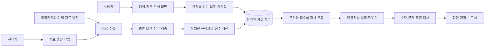
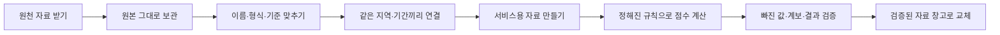
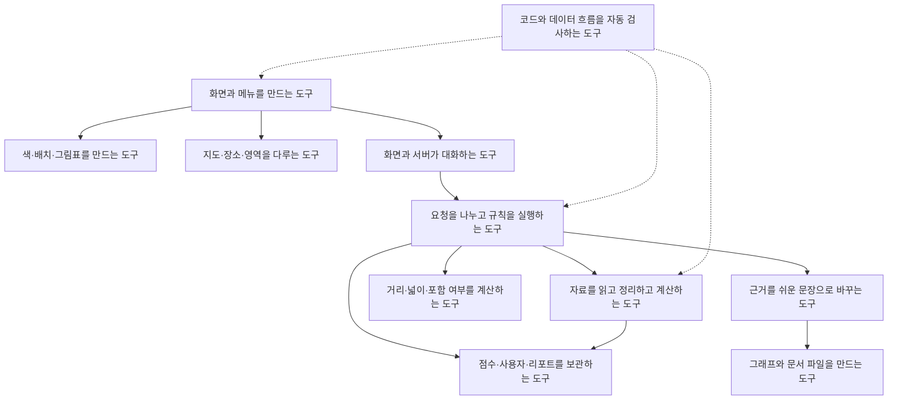

# LocalFit Lab 시스템 구조와 기술 스택 — 비전문가용 쉬운 설명

> 기준: 2026-07-21 현재 로컬 작업 트리  
> 대상: 개발자가 아닌 팀원, 기획자, 발표를 듣는 사람  
> 읽는 데 필요한 사전 지식: 없음

## 먼저 한 문장으로

LocalFit Lab은 **서울의 상권 자료를 미리 정리해 입지 점수를 만들어 두고, 사용자가 지역과 업종을 고르면 그 자료를 찾아 지도·분석 화면·쉬운 설명·보고서로 보여주는 서비스**다.

여기서 인공지능은 점수를 마음대로 정하는 심사위원이 아니다. 이미 계산된 점수와 근거를 사람이 읽기 좋은 말로 풀어주는 **설명 도우미**다.

## 1. 시스템 구조 — 순한글 쉬운 그림

이 그림은 기술 이름을 빼고 각 부분이 무슨 일을 하는지만 보여준다.

### 그림을 식당에 비유하면

- **검색·지도·분석 화면**은 손님이 주문하는 안내 데스크다.
- **업무 처리실**은 주문을 읽고 필요한 일을 나누는 주방이다.
- **정리된 자료 창고**는 재료와 장부가 정돈된 창고다.
- **정해진 규칙으로 점수 계산**은 재료를 평가하는 공통 조리법이다. 누구의 기분에 따라 바뀌지 않도록 미리 정한 기준을 쓴다.
- **인공지능 설명 도우미**는 완성된 결과를 손님이 이해할 말로 설명하는 직원이다. 재료의 무게나 점수를 새로 정하는 사람은 아니다.
- **숫자·근거·표현 검사**는 주문과 결과가 맞는지 확인하는 최종 검수다.
- **관리자 자료 갱신**은 새 재료를 받고, 오래된 장부를 갱신하고, 검사가 끝난 자료만 다시 창고에 넣는 작업이다.

## 2. 사용자가 실제로 겪는 흐름

### 상권을 찾아볼 때

1. 사용자가 지역 이름을 검색하거나 지도에서 상권을 고른다.
2. 화면이 서버에 “이 상권 자료를 달라”고 요청한다.
3. 서버는 정리된 자료 창고에서 매출, 점포, 인구, 비용 참고값, 입지 점수 등을 찾는다.
4. 화면은 표, 숫자, 그래프, 지도 경계로 결과를 보여준다.

### 인공지능 리포트를 만들 때

1. 사용자가 상권, 업종, 필요하면 예산을 고른다.
2. 서버가 이미 계산된 점수와 실제 근거 숫자를 한 묶음으로 만든다.
3. 인공지능에게 “이 근거 안에서만 쉽게 설명하라”고 요청한다.
4. 별도의 검사기가 없는 숫자, 과한 주장, 근거 누락, 필요한 그림·대안 누락을 확인한다.
5. 결과를 화면에 보여주고, 사용자가 원하면 저장하거나 문서 파일로 내려받는다.

### 입지봇에게 물어볼 때

1. 입지봇은 대화에서 지역, 업종, 예산, 질문 목적을 정리한다.
2. 단순 질문이면 선택한 상권 자료와 직전 리포트 근거로 짧게 답한다.
3. 사용자가 리포트를 명확히 요청하면 상세 리포트와 같은 분석·설명 과정을 사용한다.
4. 로그인한 사용자는 상담 결과와 리포트를 나중에 다시 볼 수 있다.

### 지도에 직접 영역을 그릴 때

1. 사용자가 지도에 원이나 다각형을 그린다.
2. 서버가 그 안에 들어오는 점포와 교통 지점을 찾는다.
3. 직접 셀 수 있는 값과 넓이 비율로 추정한 값을 구분해 돌려준다.
4. 화면은 계산 방식과 신뢰도를 함께 보여준다.

## 3. 자료가 만들어지는 흐름

자료를 받을 때마다 사용자가 기다리면서 처음부터 계산하는 방식이 아니다. 관리자가 갱신 작업을 실행해 자료와 점수를 미리 만들어 두고, 사용자는 준비된 결과를 빠르게 조회한다.

현재 핵심 갱신은 17단계다. 다만 아주 크거나 아직 후보 단계인 일부 원천은 별도 작업으로 관리되므로 “세상의 모든 자료가 한 번에 자동 갱신된다”는 뜻은 아니다.

## 4. 기술 스택 — 순한글 쉬운 그림

기술 스택은 서비스를 만드는 데 사용한 **도구 상자**다. 아래 그림도 먼저 역할만 보여준다.

## 5. 실제 도구 이름 대응표

순한글 그림의 각 역할은 실제로 다음 기술을 사용한다. 이 표는 이름을 외우기 위한 것이 아니라, 팀원이 “어디를 고칠 때 누구에게 물어봐야 하는지” 찾는 용도다.

| 쉬운 역할 | 실제 기술 이름 | 하는 일 |
| --- | --- | --- |
| 화면과 메뉴 | Next.js, React, TypeScript | 페이지, 메뉴, 버튼, 상태, 화면 이동 |
| 색·배치 | Tailwind CSS | 화면 모양과 반응형 배치 |
| 그림표 | Recharts | 매출·점포·비교 그래프 |
| 지도·장소·영역 | Kakao Maps JavaScript SDK | 지도 표시, 장소 검색, 공식 경계와 사용자 도형 |
| 화면과 서버의 대화 | 브라우저 Fetch | 화면에서 서버 주소로 요청 보내기 |
| 요청 처리 | FastAPI, Uvicorn, Pydantic | 주소별 기능 실행, 입력·출력 모양 검사 |
| 자료 연결 | SQLAlchemy | 서버 코드와 자료 창고 연결 |
| 자료 창고 | SQLite, RTree | 상권·점수·사용자·리포트·공간 위치 저장 |
| 자료 정리·점수 | Python, Pandas, NumPy | 원천 정리, 표 만들기, 정해진 규칙 계산 |
| 공간 계산 | Shapely, pyproj | 도형 포함, 교차, 넓이, 좌표 바꾸기 |
| 인공지능 설명 | langchain-openai, OpenAI | 근거 묶음을 한국어 설명으로 바꾸기 |
| 그래프·문서 | Matplotlib, ReportLab | 그림 파일과 문서 파일 만들기 |
| 로그인·권한 | JWT, bcrypt | 로그인 표식 발급, 비밀번호 보호 |
| 자동 검사 | GitHub Actions | 코드 검사와 전체 데이터 흐름 검증 |

### 현재 대표 버전

- 화면: Next.js 16.2.10, React 19.2.4, TypeScript 5.9.3
- 서버: Python 3.12.12, FastAPI 0.139.0
- 자료 연결: SQLAlchemy 2.0.51, SQLite
- 자료 처리: Pandas 3.0.3, NumPy 2.5.1
- 공간: Shapely 2.1.2, pyproj 3.7.2
- 인공지능 연결: OpenAI SDK 2.45.0, 기본 모델 이름 `gpt-5.4-mini`
- 문서: Matplotlib 3.11.0, ReportLab 5.0.0

화면 쪽은 잠금 파일로 설치 버전이 고정되어 있다. 서버 쪽은 필요한 기술 이름만 적고 버전을 고정하지 않은 파일을 사용하므로, 다른 컴퓨터에서 새로 설치하면 버전이 달라질 수 있다.

## 6. 지금 되는 것과 아직 안 된 것

### 지금 코드와 실행 상태로 확인된 것

- 상권 검색, 순위, 상세 분석
- 지도에서 공식 상권과 사용자 지정 영역 분석
- 단일 상권·비교 인공지능 리포트
- 리포트 저장, 그래프, 문서 내려받기
- 입지봇 일반 질문과 리포트 요청
- 회원·게스트·즐겨찾기·댓글·마이페이지
- 관리자 자료 원천, 갱신 작업, 품질, 비용, 오류, 댓글 관리
- 코드 자동 검사와 실제 자료를 이용한 내부 전체 흐름 검증

### 아직 현재 시스템으로 확인되지 않은 것

- 아마존 웹 서비스 배포
- 운영 도메인과 보안 연결 주소
- 운영용 앞단 서버와 인증서
- 여러 서버가 동시에 쓰는 중앙 자료 창고
- 여러 서버가 나눠 처리하는 작업 대기열
- 리포트 파일의 외부 저장소
- 자동 운영 배포

따라서 지금 문서에 “아마존 서버, 중앙 자료 창고, 파일 보관 서비스, 도메인 연결”을 그려 넣으면 실제 구조가 아니라 미래 계획을 사실처럼 말하는 셈이 된다.

## 7. 같은 팀원에게 설명할 때 꼭 말할 세 가지

1. **점수는 인공지능의 의견이 아니다.** 공공 자료를 정리하고 정해진 규칙으로 계산한 결과다.
2. **인공지능은 설명 담당이다.** 점수와 근거를 사용자가 읽기 쉽게 풀고, 별도 검사기가 과한 주장과 숫자 오류를 확인한다.
3. **현재는 로컬 실행 구조다.** 아마존 웹 서비스와 도메인이 끝나면 저장소, 주소, 보안, 작업 처리 구조를 다시 문서에 반영해야 한다.

## 8. 일 분 소개 예시

> “LocalFit Lab은 서울 상권 자료를 원본부터 정리하고 검증해서 입지 점수를 미리 만들어 두는 서비스입니다. 사용자가 지역과 업종을 고르면 화면이 서버에 요청하고, 서버는 저장된 매출·점포·인구·비용 참고값과 점수를 꺼냅니다. 인공지능은 그 결과를 새로 채점하지 않고 이해하기 쉬운 리포트와 답변으로 풀어줍니다. 지도에서는 공식 상권뿐 아니라 사용자가 그린 영역도 분석할 수 있습니다. 관리자는 자료 수집부터 점수·검증·자료 창고 교체까지 갱신 작업을 실행합니다. 지금은 한 컴퓨터의 로컬 자료 창고와 파일을 쓰는 구조이고, 아마존 웹 서비스와 운영 도메인은 아직 별도 설계가 필요한 상태입니다.”

더 기술적인 질문이 나오면 [01_detailed_reference.md](01_detailed_reference.md)를, 다른 LLM에게 넘길 때는 [02_llm_handoff.md](02_llm_handoff.md)를 사용한다.
